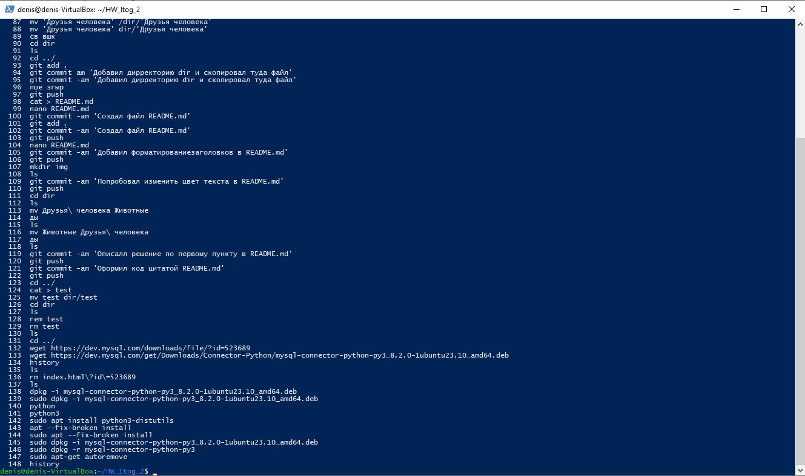
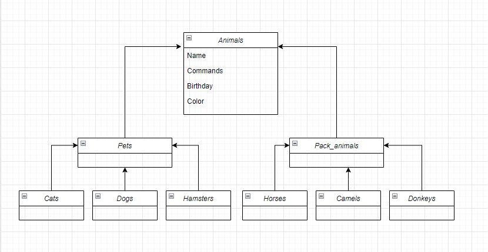

# Итоговая контрольная работа
## Информация о проекте
Необходимо организовать систему учета для питомника в котором живут
домашние и вьючные животные.
### Как сдавать проект
Для сдачи проекта необходимо создать отдельный общедоступный
репозиторий(Github, gitlub, или Bitbucket). Разработку вести в этом
репозитории, использовать пул реквесты на изменения. Программа должна
запускаться и работать, ошибок при выполнении программы быть не должно.
Программа, может использоваться в различных системах, поэтому необходимо
разработать класс в виде конструктора
### Задание
***1.*** Используя команду cat в терминале операционной системы Linux, создать
два файла Домашние животные (заполнив файл собаками, кошками,
хомяками) и Вьючные животными заполнив файл Лошадьми, верблюдами и
ослы), а затем объединить их. Просмотреть содержимое созданного файла.
Переименовать файл, дав ему новое имя (Друзья человека).

Создаем два файла и наполняем их животными

> *cat > 'Домашние животные'*
>*cat > 'Вьючные животные'*

Объединяем их в один файл

>*cat 'Домашние животные' 'Вьючные животные' > Животные*

Для просмотра используем редактор nano

>*nano Животные*

Переименовываем файл

>*mv Животные 'Друзья человека'*

***2.*** Создать директорию, переместить файл туда.

>*mkdir dir*
>*mv Друзья человека dir/Друзья человека*

***3.*** Подключить дополнительный репозиторий MySQL. Установить любой пакет
из этого репозитория.
***4.*** Установить и удалить deb-пакет с помощью dpkg.

Скачиваем mysql коннектор для python

 >*dpkg -i mysql-connector-python-py3_8.2.0-1ubuntu23.10_amd64.deb*

Устанавливаем скачанный пакет

>*sudo dpkg -i mysql-connector-python-py3_8.2.0-1ubuntu23.10_amd64.deb*

Удаляем установленный пакет

>*sudo dpkg -r mysql-connector-python-py3*

***6***. Выложить историю команд в терминале ubuntu

>*history*



7. Нарисовать диаграмму, в которой есть класс родительский класс, домашние
животные и вьючные животные, в составы которых в случае домашних
животных войдут классы: собаки, кошки, хомяки, а в класс вьючные животные
войдут: Лошади, верблюды и ослы).



***8***. В подключенном MySQL репозитории создать базу данных “Друзья
человека”

>Создаем базу данных
```sql 
create database human_friends
```

***9***. Создать таблицы с иерархией из диаграммы в БД

***10***. Заполнить низкоуровневые таблицы именами(животных), командами
которые они выполняют и датами рождения

>Создаем таблицу класса животных и наполняем её
```sql
CREATE TABLE `animal_classes` (
  `id` int NOT NULL AUTO_INCREMENT,
  `name` varchar(50) NOT NULL,
PRIMARY KEY(id)
);

INSERT INTO `animal_classes` (`id`, `name`) VALUES
(1, 'Домашние животные'),
(2, 'Вьючные животные');
```
>Создаем таблицу с типами домашних животных и наполняем её
```sql
CREATE TABLE `animals_types` (
  `id` int NOT NULL AUTO_INCREMENT,
  `name` varchar(50) NOT NULL,
  `animal_classes_id` int NOT NULL,
   PRIMARY KEY(id),
   FOREIGN KEY (animal_classes_id) REFERENCES animal_classes (id) on DELETE CASCADE on UPDATE CASCADE
);

INSERT INTO `animals_types` (`id`, `name`, `animal_classes_id`) VALUES
(1, 'Кошка', 1),
(2, 'Собака', 1),
(3, 'Хомяк', 1),
(4, 'Лошадь', 2),
(5, 'Верблюд', 2),
(6, 'Осёл', 2);
```
>Создаем таблицу с цветами и наполняем её
```sql
CREATE TABLE `colors` (
  `id` int NOT NULL AUTO_INCREMENT,
  `color` varchar(50) NOT NULL,
PRIMARY KEY (id)
);

INSERT INTO `colors` (`id`, `color`) VALUES
(1, 'Белый'),
(2, 'Серый'),
(3, 'Черный'),
(4, 'Белый с черными пятнами'),
(5, 'Рыжий'),
(6, 'Коричневый'),
(7, 'Черный с белыми пятнами'),
(8, 'Серый с белыми пятнами'),
(9, 'Светло-жёлтый'),
(10, 'Бурый');
```

>Создаем таблицу с командами и наполняем её
```sql
CREATE TABLE `animals_commands` (
  `id` int NOT NULL AUTO_INCREMENT,
  `animal_id` int NOT NULL,
  `animal_type` int NOT NULL,
  `command_id` int NOT NULL,
   PRIMARY KEY(id)
)

INSERT INTO `commands` (`id`, `name`) VALUES
(1, 'Лежать'),
(2, 'Сидеть'),
(3, 'Голос'),
(4, 'Вперед'),
(5, 'Стоять'),
(6, 'Ждать'),
(7, 'Место'),
(8, 'Дай лапу');
```
>Создаем таблицу для связи многое ко многим животного и команды, связывать будем по полям animal_id и animal_type
>так как animal_id может совпадать у разных животных
```sql
CREATE TABLE `animals_to_commands` (
 `id` INT NOT NULL AUTO_INCREMENT ,
 `animal_id` INT NOT NULL,
 `animal_type` INT NOT NULL,
 `command_id` INT NOT NULL ,
PRIMARY KEY (`id`));
```
>Создаем таблицу верблюды и наполняем её
```sql
CREATE TABLE `camels` (
  `id` int NOT NULL AUTO_INCREMENT,
  `name` varchar(50) NOT NULL,
  `Birthday` date NOT NULL,
  `Color` INT,
  `animal_types_id` int NOT NULL DEFAULT '5',
   PRIMARY KEY(id),
   FOREIGN KEY (animal_types_id) REFERENCES animals_types (id) on DELETE CASCADE on UPDATE CASCADE
);

INSERT INTO `camels` (`id`, `name`, `Birthday`, `Color`, `animal_types_id`) VALUES
(1, 'Агата', '1998-01-08', 9, 5),
(2, 'Чайна', '2001-11-22', 10, 5),
(3, 'Мария', '2012-12-13', 10, 5),
(4, 'Твист', '2020-02-21', 9, 5),
(5, 'Ланцелот', '2018-03-13', 10, 5);
```
>Создаем таблицу Кошки и наполняем её
```sql
CREATE TABLE `cats` (
  `id` int NOT NULL AUTO_INCREMENT,
  `name` varchar(50) NOT NULL,
  `Birthday` date NOT NULL,
  `Color` INT,
  `animal_types_id` int NOT NULL DEFAULT '1',
PRIMARY KEY(id),
FOREIGN KEY (animal_types_id) REFERENCES animals_types (id) on DELETE CASCADE on UPDATE CASCADE
);

INSERT INTO `cats` (`id`, `name`, `Birthday`, `Color`, `animal_classes_id`) VALUES
(1, 'Барсик', '2018-12-12', 1, 1),
(2, 'Ириска', '2015-08-12', 2, 1),
(3, 'Муська', '2011-08-14', 4, 1),
(4, 'Мотя', '2013-04-18', 7, 1),
(5, 'Масяня', '2021-12-09', 8, 1);
```

>Создаем таблицу Собаки и наполняем её
```sql
CREATE TABLE `dogs` (
  `id` int NOT NULL AUTO_INCREMENT,
  `name` varchar(50) NOT NULL,
  `Birthday` date NOT NULL,
  `Color` INT,
  `animal_types_id` int NOT NULL DEFAULT '2',
PRIMARY KEY(id),
FOREIGN KEY (animal_types_id) REFERENCES animals_types (id) on DELETE CASCADE on UPDATE CASCADE
)

INSERT INTO `dogs` (`id`, `name`, `Birthday`, `Color`, `animal_types_id`) VALUES
(1, 'Бобик', '2018-12-12', 1, 2),
(2, 'Майк', '2015-05-08', 2, 2),
(3, 'Локи', '2019-08-14', 4, 2),
(4, 'Герда', '2023-04-28', 7, 2),
(5, 'Лесси', '2022-10-16', 8, 2);
```

>Создаем таблицу Ослы и наполняем её
```sql
CREATE TABLE `donkeys` (
  `id` int NOT NULL AUTO_INCREMENT,
  `name` varchar(50) NOT NULL,
  `Birthday` date NOT NULL,
  `Color` INT,
  `animal_types_id` int NOT NULL DEFAULT '6',
PRIMARY KEY(id),
FOREIGN KEY (animal_types_id) REFERENCES animals_types (id) on DELETE CASCADE on UPDATE CASCADE
);

INSERT INTO `donkeys` (`id`, `name`, `Birthday`, `Color`, `animal_types_id`) VALUES
(1, 'Иа', '2015-03-15', 2, 6),
(2, 'Ослик', '2020-05-17', 6, 6),
(3, 'Чита', '2011-07-11', 2, 6),
(4, 'Элиос', '2013-05-19', 2, 6),
(5, 'Лунтик', '2018-07-22', 2, 6);
```
>Создаем таблицу Хомяки и наполняем её
```sql
CREATE TABLE `hamsters` (
  `id` int NOT NULL  AUTO_INCREMENT,
  `name` varchar(50) NOT NULL,
  `Birthday` date NOT NULL,
  `Color` int,
  `animal_types_id` int NOT NULL DEFAULT '3',
PRIMARY KEY(id),
FOREIGN KEY (animal_types_id) REFERENCES animals_types (id) on DELETE CASCADE on UPDATE CASCADE
) ;

INSERT INTO `hamsters` (`id`, `name`, `Birthday`, `Color`, `animal_types_id`) VALUES
(1, 'Хомик', '2022-12-18', 5, 3),
(2, 'Ириска', '2020-08-14', 5, 3),
(3, 'Бубус', '2021-11-16', 2, 3),
(4, 'Баззи', '2022-04-18', 2, 3),
(5, 'Жоржик', '2021-12-22', 8, 3);
```

>Создаем таблицу Лошади и наполняем её
```sql
CREATE TABLE `horses` (
  `id` int NOT NULL AUTO_INCREMENT,
  `name` varchar(50) NOT NULL,
  `Birthday` date NOT NULL,
  `Color` int,
  `animal_types_id` int NOT NULL DEFAULT '4',
PRIMARY KEY(id),
FOREIGN KEY (animal_types_id) REFERENCES animals_types (id) on DELETE CASCADE on UPDATE CASCADE
) ;

INSERT INTO `horses` (`id`, `name`, `Birthday`, `Color`, `animal_types_id`) VALUES
(1, 'Ярость', '2000-07-18', 5, 4),
(2, 'Рысак', '2018-01-18', 6, 4),
(3, 'Лиса', '2010-10-06', 2, 4),
(4, 'Коршун', '2014-04-12', 3, 4),
(5, 'Тигрица', '2021-02-12', 8, 4);
```

***11***. Удалив из таблицы верблюдов, т.к. верблюдов решили перевезти в другой
питомник на зимовку. Объединить таблицы лошади, и ослы в одну таблицу.

>Удаляем всех верблюдов
```sql
SET SQL_SAFE_UPDATES = 0;
DELETE FROM camels;
```

>Объединяем таблицы с лошадьми и ослами в одтельной таблице
```sql
create table horses_and_donkeys as
select 
	ROW_NUMBER() over() as id, 
    horses_and_donkeys.* from(
		select name, Birthday, Color, animal_types_id from horses
		union
		select name, Birthday, Color, animal_types_id from donkeys
	) as horses_and_donkeys
```
***12***.Создать новую таблицу “молодые животные” в которую попадут все
животные старше 1 года, но младше 3 лет и в отдельном столбце с точностью
до месяца подсчитать возраст животных в новой таблице

```sql
CREATE TABLE young_animals AS
select
	-- Нумеруем все строки
	ROW_NUMBER() over() as id, 
    	young_animals.* ,
    	CONCAT('Лет: ', TIMESTAMPDIFF(YEAR, Birthday, CURDATE()), ' Месяцев: ', TIMESTAMPDIFF(MONTH, Birthday, CURDATE())%12) as age
FROM(
	select name, Birthday, Color, animal_types_id from horses
	UNION
		select name, Birthday, Color, animal_types_id from donkeys
        UNION
        	select name, Birthday, Color, animal_types_id from dogs
	UNION
		select name, Birthday, Color, animal_types_id from cats
        UNION
		select name, Birthday, Color, animal_types_id from hamsters
) as young_animals
WHERE Birthday > ADDDATE(curdate(), INTERVAL -3 YEAR) AND Birthday < ADDDATE(curdate(), INTERVAL -1 YEAR)
```

13. Объединить все таблицы в одну, при этом сохраняя поля, указывающие на
прошлую принадлежность к старым таблицам.

```sql
CREATE TABLE animals as
SELECT 
	-- Нумеруем все строки
	ROW_NUMBER() over() as id, 
    	animals.* ,
    	animals_types.name as type_name
FROM(
	select name, Birthday, Color, animal_types_id from horses
	UNION
	select name, Birthday, Color, animal_types_id from donkeys
        UNION
        select name, Birthday, Color, animal_types_id from dogs
	UNION
	select name, Birthday, Color, animal_types_id from cats
        UNION
	select name, Birthday, Color, animal_types_id from hamsters
) as animals
LEFT JOIN animals_types on animals.animal_types_id = animals_types.id
```

14.Создать класс с Инкапсуляцией методов и наследованием по диаграмме.

[Файлы с классами](https://github.com/Desa-196/HW_Itog_2/tree/wpfPORG/AnymalsPROG/AnymalsPROG/Model)

15. Написать программу, имитирующую работу реестра домашних животных.
В программе должен быть реализован следующий функционал:

15.1 Завести новое животное

15.2 определять животное в правильный класс

15.3 увидеть список команд, которое выполняет животное

15.4 обучить животное новым командам

15.5 Реализовать навигацию по меню
